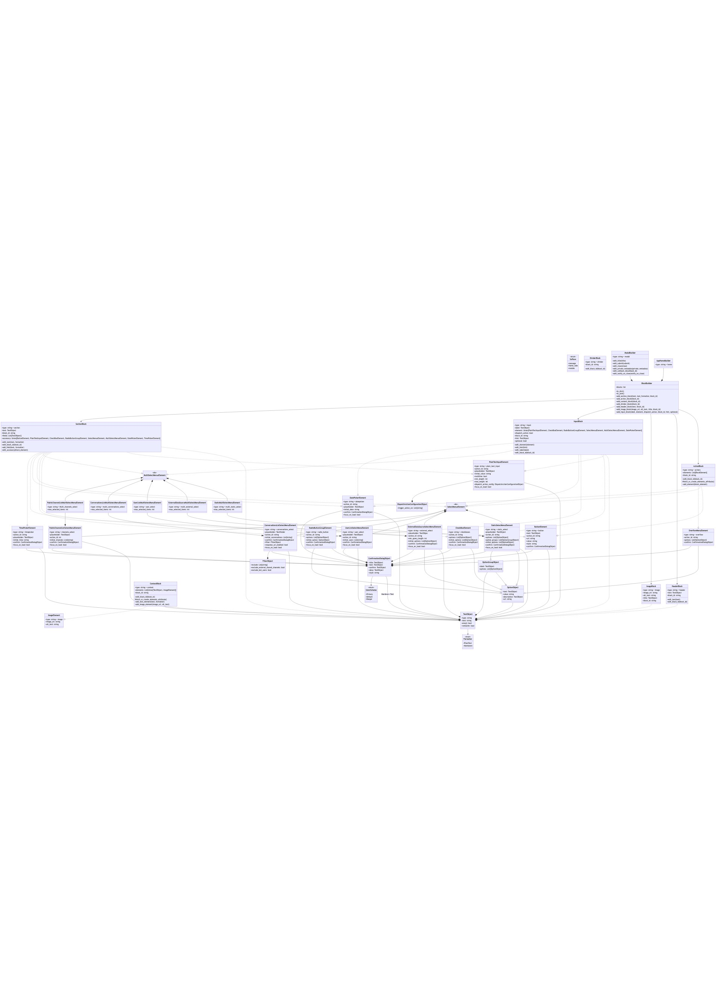
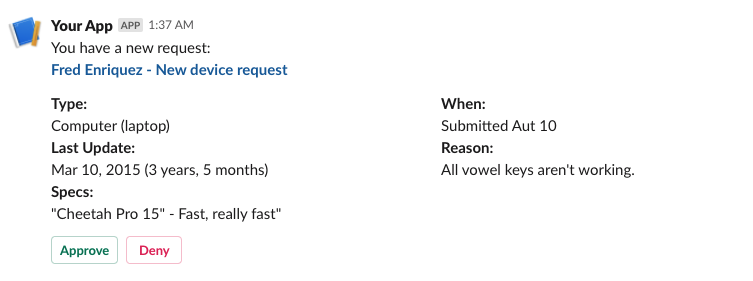

# Title: Slack Blocker Builder

## Introduction

There are a lot of message blocks that need to be built during on whole chatbot project.

For consistent behaviour on message constructive, Need a uniform blocks builder class for the whole project.


## Proposed Design

### Data Model



### Example Code

#### The expected message below:



#### The Json Format:

```json
{
	"blocks": [
		{
			"type": "section",
			"text": {
				"type": "mrkdwn",
				"text": "You have a new request:\n*<fakeLink.toEmployeeProfile.com|Fred Enriquez - New device request>*"
			}
		},
		{
			"type": "section",
			"fields": [
				{
					"type": "mrkdwn",
					"text": "*Type:*\nComputer (laptop)"
				},
				{
					"type": "mrkdwn",
					"text": "*When:*\nSubmitted Aut 10"
				},
				{
					"type": "mrkdwn",
					"text": "*Last Update:*\nMar 10, 2015 (3 years, 5 months)"
				},
				{
					"type": "mrkdwn",
					"text": "*Reason:*\nAll vowel keys aren't working."
				},
				{
					"type": "mrkdwn",
					"text": "*Specs:*\n\"Cheetah Pro 15\" - Fast, really fast\""
				}
			]
		},
		{
			"type": "actions",
			"elements": [
				{
					"type": "button",
					"text": {
						"type": "plain_text",
						"emoji": true,
						"text": "Approve"
					},
					"style": "primary",
					"value": "click_me_123"
				},
				{
					"type": "button",
					"text": {
						"type": "plain_text",
						"emoji": true,
						"text": "Deny"
					},
					"style": "danger",
					"value": "click_me_123"
				}
			]
		}
	]
}
```

#### Block Builder Code

The sample code [here](../assets/sample_code/block_builder/block_builder_example_1.py)

```python
from slack_block_builder import BlockBuilder, Formatter
from slack_block_builder.components.block_element import ButtonElement, ColorScheme


def main():
    builder = BlockBuilder()
    # index 1
    builder.add_section_block(text='You have a new request:\n*<fakeLink.toEmployeeProfile.com|Fred Enriquez - New device request>*',
                              text_formatter=Formatter.MarkDown)
    # index 2
    section_block = builder.add_section_block()
    section_block.add_field(text='*Type:*\nComputer (laptop)', formatter=Formatter.MarkDown)
    section_block.add_field(text='*When:*\nSubmitted Aut 10', formatter=Formatter.MarkDown)
    section_block.add_field(text='*Last Update:*\nMar 10, 2015 (3 years, 5 months)', formatter=Formatter.MarkDown)
    section_block.add_field(text="*Reason:*\nAll vowel keys aren't working.", formatter=Formatter.MarkDown)
    section_block.add_field(text="*Specs:*\n\"Cheetah Pro 15\" - Fast, really fast\"", formatter=Formatter.MarkDown)
    #index 3
    approve_button = ButtonElement(text="Approce", style=ColorScheme.Primary)
    deny_button = ButtonElement(text="Deny", style=ColorScheme.Danger)
    buttons_block = builder.add_action_block()
    buttons_block.add_element(approve_button)
    buttons_block.add_element(deny_button)
    # export to json
    print(builder.to_json())


if __name__ == '__main__':
    main()
```

